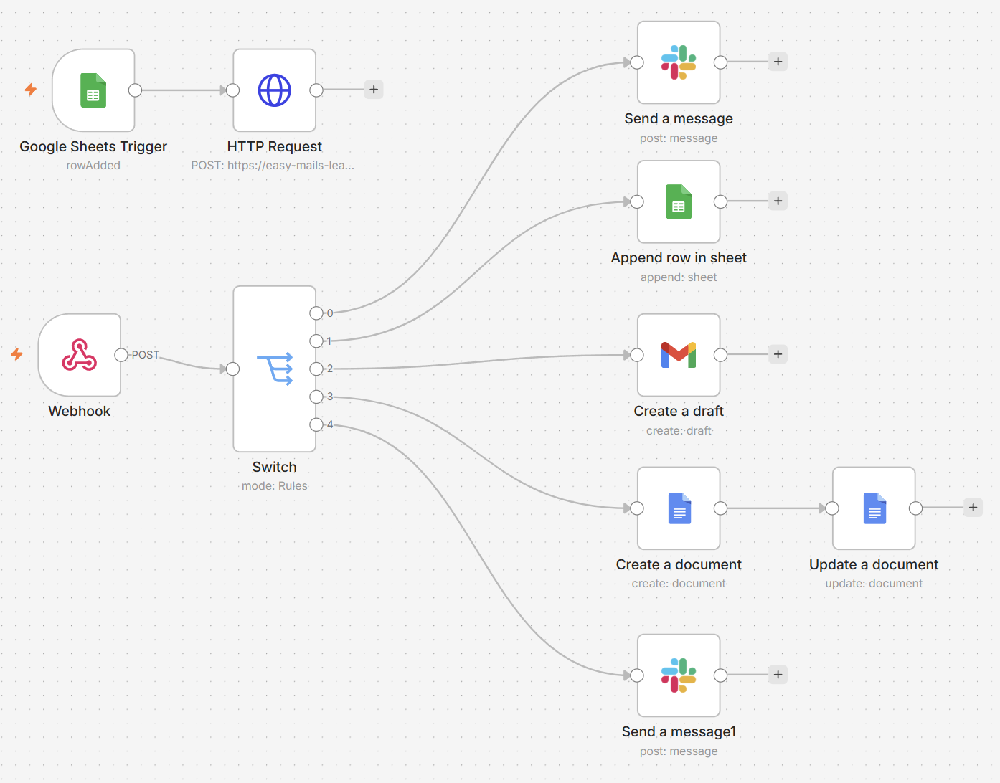

# SM Task Tracker

A one-line quick-capture and measurement layer for agile team leads — not a
Jira replacement, but a note you capture in a single line, in five seconds,
during a meeting. AI turns it into a usable artifact, and the app
**measures** whether the AI is actually saving time, instead of just
assuming it is.

A single-user project built for personal use that also doubles as a
full-stack technical showcase: data modeling, provider-independent AI
integration, a measurement layer, and a two-way automation layer built on
n8n.

*(The interface itself is in Hungarian — it was built for the author's own
day-to-day use as a team lead. The screenshots below reflect that.)*

---

## The problem

An agile team lead's day is full of scattered notes — an impediment that
comes up mid-daily, an action item mentioned in a 1:1, a decision made
after a retro. These either get lost, or end up in some separate tool
(a notebook, a Slack DM to yourself) they never leave — never becoming a
backlog item, a message to the right owner, or a meeting agenda.

## The solution

**Single-line quick capture**, with built-in syntax:

```
Akadály @kata #alfa-csapat >holnap !
```

*(Impediment @kate #alpha-team >tomorrow !)* — `@` marks the owner, `#` the
tag, `>` the due date, `!` importance — plus a context switcher ("what I'm
in right now: daily / 1:1 / retro / …"), so nothing needs to be re-entered
mid-meeting.


---

## The AI layer: not "there's AI," but *measured to see if it's worth it*

One click turns a note into a user story, backlog item, colleague brief,
or follow-up message — and in the retro view, an AI synthesis surfaces
recurring themes and impediments across the whole entry stream.

**The key decision**: every AI output goes through a review panel
(editable, Accept/Discard) — the AI *never* writes anything to the app
automatically. That's not just a safety net, it's the basis for the
measurement: every decision is logged (accepted / edited / discarded, how
much the text changed), so the `/insights` page can answer, with data,
whether the AI is actually saving time — not by impression.


**Provider-independent**: the layer is built on an OpenAI-compatible wire
format, with a 3-tier fallback chain (Groq → CLōD → Gemini) that switches
automatically on quota or server errors. The same code runs against any
provider — and since every run is logged together with the provider name,
the `/insights` page also shows which *free* model actually performs
better on the author's own notes.


---

## Two-way automation with n8n

This project's most interesting architectural decision: **one generic,
signed webhook event, not per-template integrations.** After the first two
events were introduced, every further workflow was built **entirely on
the n8n side**, with zero app code changes.

**Outbound** (app → n8n):
- `entry.impediment_created` — fires when an Impediment entry is saved
- `ai.accepted` — fires on any accepted AI output, with a `data.template`
  field identifying which template produced it

**Inbound** (n8n → app), protected by a separate secret, not the app's
password gate:
- team members can flag an impediment through a Google Form, without ever
  opening the app

Both events together power all **6 workflows built so far**:

| # | Workflow | Target node | Needed app code? |
|---|---|---|---|
| 1 | Impediment → Slack alert | Slack | yes (introduced the first event) |
| 2 | Accepted backlog item → Google Sheet | Sheets | yes (introduced `ai.accepted`) |
| 3 | Accepted follow-up message → Gmail draft | Gmail | **no** |
| 4 | Accepted retro synthesis → Google Docs | Docs | yes (small field addition) |
| 5 | Accepted meeting-prep → Slack | Slack | **no** |
| 6 | Google Form → app (creates an Impediment) | — | yes (inbound endpoint) |

Workflows #3 and #5 were built with zero app code — proof of the original
bet: one well-designed event can serve many different consumers without
any schema changes.



---

## All entries, retro prep


---

## Tech stack

- **Next.js 16** (App Router, Server Actions, Route Handlers) + TypeScript
- **Tailwind CSS v4**
- **Drizzle ORM** + libSQL (SQLite locally, [Turso](https://turso.tech) in the cloud)
- **[Vitest](https://vitest.dev)** — unit tests for the parser and AI helper functions
- **[`openai`](https://github.com/openai/openai-node)** SDK (OpenAI-compatible wire format, no provider lock-in) + **`zod`**
- **n8n** — two-way webhook automation (Slack, Google Sheets, Gmail, Google Docs, Google Forms)
- Built with an AI-assisted workflow (vibe coding).

---

## Live demo

There's a deployed, `Vercel + Turso`-based version with made-up demo data
— not a public link, since the AI layer runs on free, quota-limited APIs,
and a publicly shared demo could easily burn through the daily quota.
**Happy to show it live on request**, or grant access.

---

*The screenshots above were taken against a demo database (made-up names,
projects) — in actual use, the notes are naturally about the author's own,
private work.*
