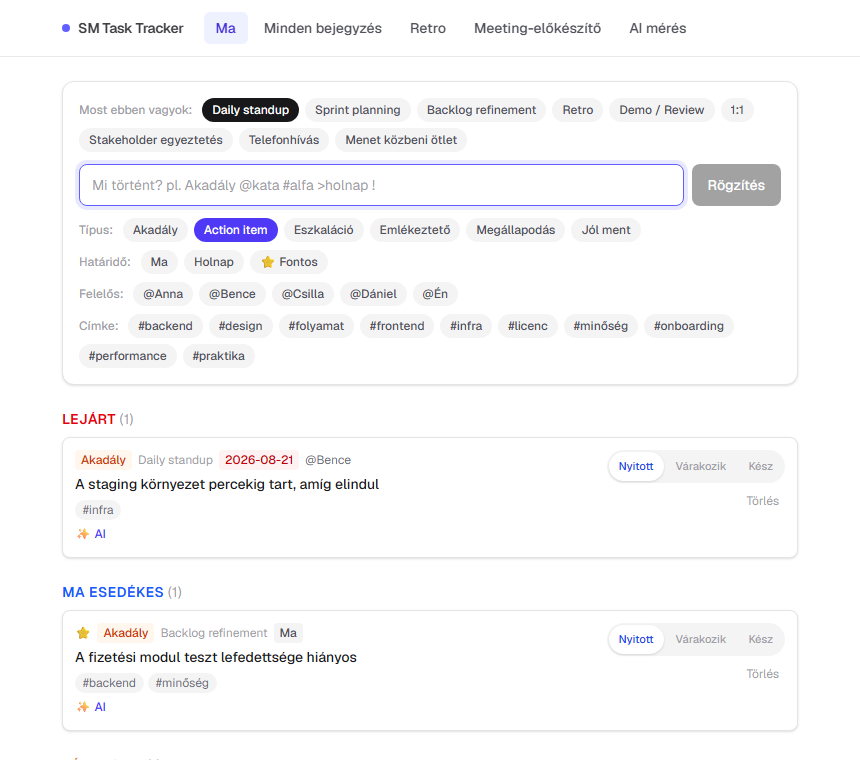
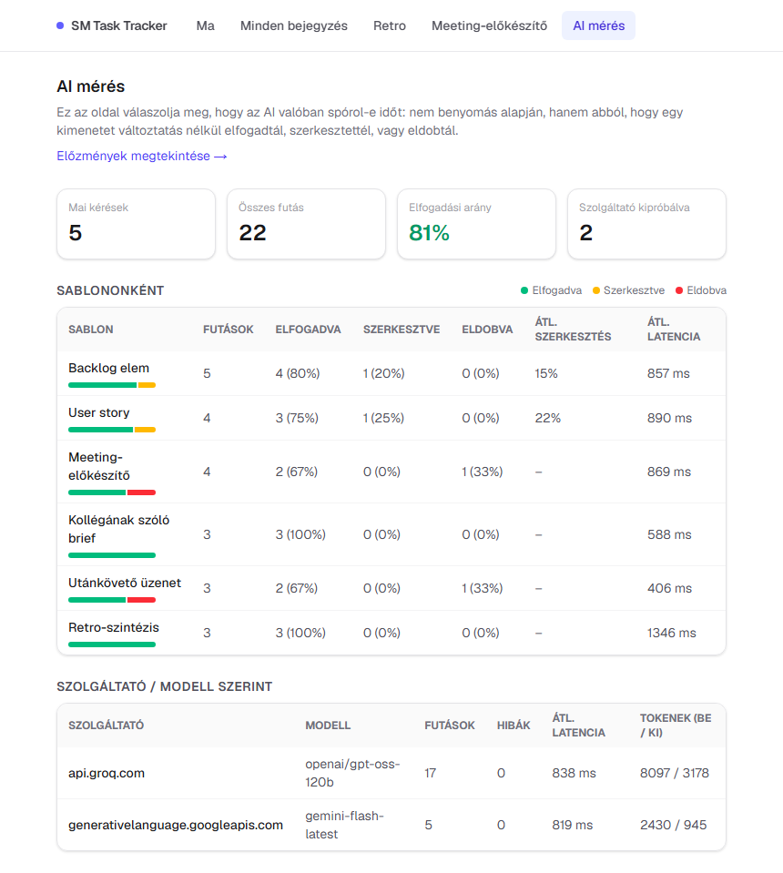
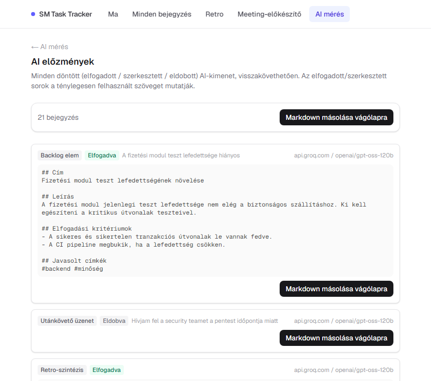
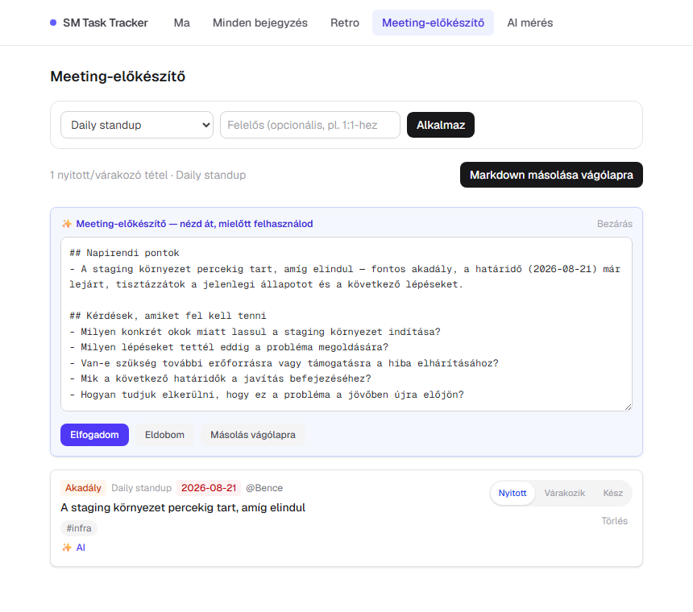
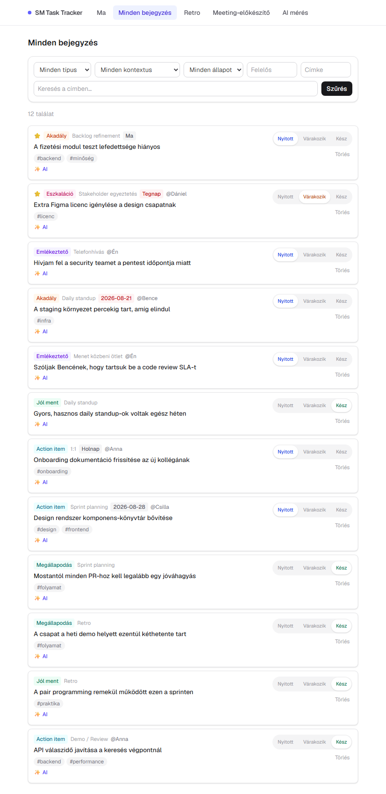
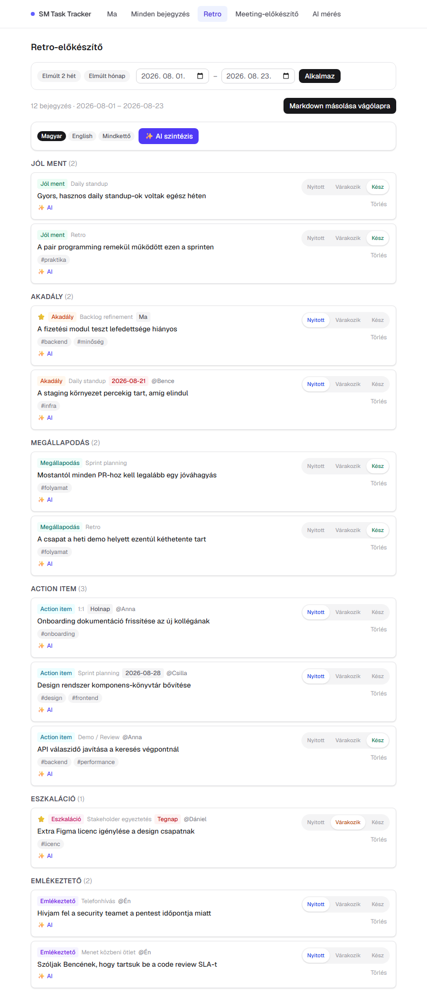

# SM Task Tracker

Egysoros gyorsrögzítő és mérési réteg agilis csapatvezetőknek — nem
Jira-pótlék, hanem egy jegyzet, amit egy meeting közben öt másodperc
alatt, egyetlen sorba írva rögzítesz, AI-val alakítasz belőle használható
artifaktot, és az app **méri**, hogy az AI ténylegesen spórol-e időt,
ahelyett hogy csak feltételeznénk.

Egyfelhasználós, saját használatra épített projekt, ami emellett teljes
körű technikai gyakorlatot mutat be: adatmodellezés, AI-integráció
provider-függetlenül, mérési réteg, és egy kétirányú automatizációs
réteg n8n-nel.

---

## A probléma

Egy agilis csapatvezető munkanapja tele van elszórt jegyzettel — daily
közben felmerülő akadály, 1:1-en elhangzott teendő, retro utáni
megállapodás. Ezek vagy elvesznek, vagy külön eszközbe (jegyzetfüzet,
Slack DM magamnak) kerülnek, ahonnan sosem lesz belőlük backlog elem,
felelősnek szóló üzenet vagy megbeszélés-napirend.

## A megoldás

**Gyorsrögzítés egyetlen sorból**, beépített szintaxissal:

```
Akadály @kata #alfa-csapat >holnap !
```

— a `@` felelőst, a `#` címkét, a `>` határidőt, a `!` fontosságot jelöl,
kontextus-váltóval ("most ebben vagyok: daily / 1:1 / retro / …"), hogy
egy meeting alatt ne kelljen újra beállítani semmit.



---

## AI-réteg: nem "van AI", hanem *mérve van, hogy megéri-e*

Egy jegyzetből egy kattintással user story, backlog elem, kollégának
szóló feladatleírás vagy utánkövető üzenet lesz — retro nézetben pedig
egy AI-szintézis emel ki témákat és ismétlődő akadályokat a bejegyzésfolyamból.

**A kulcsdöntés**: minden AI-kimenet egy review-panelen megy át
(szerkeszthető, Elfogadom/Eldobom) — az AI *soha* nem ír semmit
automatikusan az appba. Ez nemcsak biztonsági háló, hanem a mérés
alapja: minden döntés naplózódik (elfogadva / szerkesztve / eldobva,
mennyit változott a szöveg), így az `/insights` oldal adattal válaszolja
meg, hogy az AI ténylegesen időt spórol-e — nem benyomás alapján.





**Provider-független**: a réteg egy OpenAI-kompatibilis wire formátumra
épül, 3-szintű fallback lánccal (Groq → CLōD → Gemini), automata váltással
kvóta- vagy szerverhibánál. Ugyanaz a kód fut bármelyik szolgáltatóval —
és mivel minden futás a szolgáltató nevével együtt naplózódik, az
`/insights` oldal azt is megmutatja, melyik *ingyenes* modell válik be
jobban a saját jegyzeteken.



---

## Kétirányú automatizáció n8n-nel

Ez a projekt legérdekesebb architekturális döntése: **egy generikus,
aláírt webhook-esemény, nem sablononkénti integráció.** Az első két
esemény bevezetése után a további workflow-k **kizárólag n8n-oldali
konfigurációval** épültek fel, app-kód módosítása nélkül.

**Kimenő** (app → n8n):
- `entry.impediment_created` — Akadály bejegyzés mentésekor
- `ai.accepted` — bármelyik elfogadott AI-kimenet, `data.template`
  mezővel megkülönböztetve, hogy melyik sablon volt

**Bejövő** (n8n → app), külön titkos kulccsal védve, nem a jelszókapun
keresztül:
- csapattagok az app használata nélkül, egy Google Formon jelezhetnek
  akadályt

Ezen a két eseményen fut mind a **6 megépített workflow**:

| # | Workflow | Célnode | Kellett hozzá app-kód? |
|---|---|---|---|
| 1 | Akadály → Slack riasztás | Slack | igen (első esemény bevezetése) |
| 2 | Elfogadott backlog elem → Google Sheet | Sheets | igen (`ai.accepted` bevezetése) |
| 3 | Elfogadott utánkövető üzenet → Gmail piszkozat | Gmail | **nem** |
| 4 | Elfogadott retro-szintézis → Google Docs | Docs | igen (kis mező-bővítés) |
| 5 | Elfogadott meeting-előkészítő → Slack | Slack | **nem** |
| 6 | Google Form → app (Akadály bejegyzés) | — | igen (bejövő végpont) |

A #3 és #5 nulla app-kóddal épült fel — ez igazolja vissza az eredeti
döntést: egy jól megtervezett esemény sok különböző fogyasztót tud
kiszolgálni séma-változtatás nélkül.

---

## Minden bejegyzés, retro-előkészítő





---

## Tech stack

- **Next.js 16** (App Router, Server Actions, Route Handlers) + TypeScript
- **Tailwind CSS v4**
- **Drizzle ORM** + libSQL (SQLite lokálisan, [Turso](https://turso.tech) felhőben)
- **[Vitest](https://vitest.dev)** — parser és AI-segédfüggvény unit tesztek
- **[`openai`](https://github.com/openai/openai-node)** SDK (OpenAI-kompatibilis wire formátum, nem provider-lock-in) + **`zod`**
- **n8n** — kétirányú webhook-automatizáció (Slack, Google Sheets, Gmail, Google Docs, Google Forms)
- A fejlesztés AI-asszisztált módszerrel (vibe coding) készült.

---

## Élő demo

Van élesített, `Vercel + Turso` alapú változat kitalált demó-adatokkal —
nem publikus link, mert az AI-réteg ingyenes, kvótás API-kra épül, és egy
nyilvánosan megosztott demó könnyen kimerítené a napi keretet. **Kérésre
szívesen megmutatom élőben**, vagy hozzáférést adok.

---

*A fenti screenshotok egy demó-adatbázison készültek (kitalált nevek,
projektek) — a valós használatban a jegyzetek természetesen a saját,
privát munkámról szólnak.*
